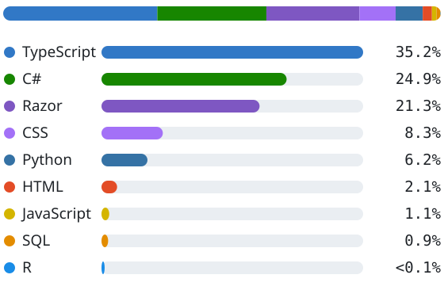
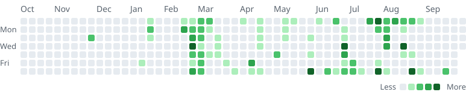

<picture>
  <source media="(prefers-color-scheme: dark)" srcset="assets/hero-dark.svg">
  
</picture>

Full-stack engineer in London. I build business platforms, mobile apps and ML products.

[LinkedIn](https://www.linkedin.com/in/muhammad-bilal-a57aaa2bb/) &nbsp;·&nbsp; [Email](mailto:bilalbhatticc683@gmail.com) &nbsp;·&nbsp; [F1 Oracle AI (live)](https://f1-oracle-ai.vercel.app)

<!--GENERATED:metrics-->
**19** repositories &nbsp;·&nbsp; **325** commits &nbsp;·&nbsp; **18** pull requests &nbsp;·&nbsp; **5** repositories owned by others
<!--/GENERATED:metrics-->

<!--GENERATED:metricsnote-->
Counts cover the 19 repositories listed below (10 private) and are taken from the GitHub API: commits authored under this account on each default branch, and pull requests opened by it (17 merged).
<!--/GENERATED:metricsnote-->

## What I build

- **Business platforms.** School management ([KAMPUS](#kampus)), restaurant operations ([Cafe Management System](#cafe-management-system)) and CRM ([RBiX](#rbix-technologies)): ASP.NET Core back ends with Next.js and React front ends.
- **Mobile and ticketing.** Expo and React Native apps for [PARCHI](#parchi) and KAMPUS, paired with an ASP.NET Core web platform.
- **Applied machine learning.** Gradient-boosting prediction and Monte Carlo simulation ([F1 Oracle AI](#f1-oracle-ai)), in-browser ONNX inference ([Cognitive Overload Detection](#cognitive-overload-detection)) and graph neural networks for transit forecasting.

Most of this work lives in repositories owned by collaborators or companies, not in my own account. The [Collaborative work](#collaborative-work) section shows where.

## Engineering profile

| Area | What the work shows |
| --- | --- |
| **Backend and data** | ASP.NET Core 8 with EF Core on PostgreSQL and SQL Server. Role-based access with branch and tenant isolation, audit logging through an EF Core interceptor, payroll and accounting rules, kitchen-printer routing. |
| **Full-stack product UI** | Next.js, React and Tailwind front ends with design-token systems, theming and dashboards; Razor views in the .NET apps. |
| **Mobile** | Expo SDK 54 and React Native: ticketing, QR check-in, quizzes with autosave and focus tracking. |
| **Applied ML** | Gradient-boosting ensembles with SHAP, Monte Carlo simulation, temporal CNNs quantised to int8 ONNX, spatio-temporal GNNs benchmarked against persistence and historical-average baselines. |
| **Hardening and quality** | Race conditions, rate limiting, row-level security replaced by server-side RPCs, money-path fixes, production-readiness and thesis audits, CI test gates. |

## Featured projects

<!--GENERATED:featured-->
### KAMPUS
> Multi-campus school management platform: academics, attendance, exams, HR and payroll, billing with double-entry accounting, and separate admin, teacher, student and parent portals plus a mobile app.

**Role** Developer  
**Evidence** 38 commits, 15 PRs merged, Jul 2026 to Aug 2026  
**Stack** `C#` `ASP.NET Core 8` `EF Core` `PostgreSQL` `Next.js 16` `React 19` `TypeScript` `Tailwind 4` `Expo / React Native`  
**Repositories** `azimystic/kampus` (private): API, web portals, mobile app · `azimystic/kampus_website` (private): marketing site (Next.js)

- Diary and whiteboard module end to end: API endpoints, attachment handling, Excalidraw whiteboards with PDF export, admin dashboard
- Expo mobile features: online quizzes with autosave and focus tracking, complaints, payroll vouchers, file downloads, Android polish
- Payroll and voucher generation, employee and teacher attendance, timetable assignment guards
- Opened merged PRs for the multi-tenant master registry and admin console, notifications with chat attachments, and the KampusAI microservice split

### [Cafe Management System](https://github.com/MuhammadBilal-00/Cafe-Manangement-System)
> Restaurant operations platform on ASP.NET Core MVC: POS, kitchen order tickets (KOT) with printer routing, orders, inventory, accounting, HR and payroll, CRM, notifications and role-based access with branch isolation.

**Role** Developer (repository owner)  
**Evidence** 109 commits, 1 PR merged, Jan 2026 to Jul 2026  
**Stack** `C#` `ASP.NET Core 8 MVC` `EF Core` `SQL Server` `Razor`  
**Repositories** [MuhammadBilal-00/Cafe-Manangement-System](https://github.com/MuhammadBilal-00/Cafe-Manangement-System)

- Hardened the money path: capped tenders, atomic redemptions, compensation on failure; ledger-true decimal stock deductions
- Versioned salary policies with a preview workflow and a three-state payroll lifecycle; audit logging through an EF Core interceptor
- Role-based access with branch-level data isolation across all controllers; production-readiness audit
- Design-token UI system with five themes, command palette, English and Urdu localisation, thermal receipts

### PARCHI
> Event ticketing platform: a React Native app for buyers and sellers, and an ASP.NET Core web platform for organisers and institutions.

**Role** Developer  
**Evidence** 63 commits, Feb 2026 to May 2026  
**Stack** `TypeScript` `React Native` `Expo SDK 54` `Supabase` `PostgreSQL` `C#` `ASP.NET Core 8` `EF Core`  
**Repositories** `azimystic/Parchi` (private): mobile app (Expo) · `azimystic/PARCHIWEB` (private): web platform (ASP.NET Core)

- QR scanner check-in for security staff, backed by server-side RPCs instead of permissive row-level security
- Seller dashboard, multi-step event creation, free-ticket auto-approval and approval workflows
- Hardening passes: approval race conditions, OTP rate limiting, CNIC validation, promo-code usage tracking
- Web: event lifecycle with shadow drafts, institution moderation and registration control; dashboards, ledger and expense modules

### RBiX Technologies
> Company website, a CRM product and internal tooling for RBiX Technologies.

**Role** Developer; owner of the website repository  
**Evidence** 24 commits, 2 PRs (1 merged), Aug 2026 to Sep 2026  
**Stack** `TypeScript` `Next.js 15` `React 19` `Vite` `Tailwind 4` `TanStack Query` `.NET 10 API` `PostgreSQL`  
**Repositories** `MuhammadBilal-00/RBiX--website` (private): company website (Next.js static export) · `Rehan00122/RBIXCRM` (private): CRM: React frontend, .NET 10 API, PostgreSQL · `MuhammadBilal-00/RBiX--Technologies` (private): internal documents and assets

- Website rebuilt as a Next.js static export in phased passes: scroll animation, mobile navigation, SEO structured data, accessibility, cPanel deployment
- CRM frontend redesigned on a shared design system; open PR for companies, contacts, tasks, import/export and full forms

### [F1 Oracle AI](https://github.com/MuhammadBilal-00/F1-Oracle-AI)
> Formula 1 analytics and prediction platform: a gradient-boosting ensemble with SHAP explanations, a Monte Carlo race simulator and a Next.js dashboard over the full Ergast history.

**Role** Author  
**Evidence** 19 commits, Jun 2026  
**Stack** `Python` `FastAPI` `XGBoost` `LightGBM` `CatBoost` `SHAP` `TypeScript` `Next.js 16` `React 19` `Tailwind 4`  
**Live** [f1-oracle-ai.vercel.app](https://f1-oracle-ai.vercel.app)  
**Repositories** [MuhammadBilal-00/F1-Oracle-AI](https://github.com/MuhammadBilal-00/F1-Oracle-AI)

- Monte Carlo engine rebuilt as a model-seeded outcome sampler, anchored to qualifying form
- What-if race predictor; constructor, circuit and driver analytics; Render blueprint and Vercel deployment

### [Cognitive Overload Detection](https://github.com/MuhammadBilal-00/Multimodal-Cognitive-Overload-Detection)
> Final-year project: engagement and cognitive-state detection from webcam video, with all inference running in the browser so video never leaves the device.

**Role** Developer (collaborative project)  
**Evidence** 48 commits, Jul 2026 to Sep 2026  
**Stack** `Python` `PyTorch` `ONNX (int8)` `onnxruntime-web` `MediaPipe` `TypeScript` `Next.js` `GitHub Actions`  
**Repositories** [MuhammadBilal-00/Multimodal-Cognitive-Overload-Detection](https://github.com/MuhammadBilal-00/Multimodal-Cognitive-Overload-Detection)

- Pipeline from DAiSEE video to features to a temporal convolutional network, quantised to an int8 ONNX model of about 60 KB
- In-browser feature extraction and inference with a strict same-origin CSP; nested cross-validation, ablations and an audit-and-remediation pass
- Test gates, CI, and the written thesis material
<!--/GENERATED:featured-->

## Projects & contributions

Everything below is work I have committed code or opened pull requests to, whoever owns the repository. Entries are selected by evidence of contribution, not by ownership.

<!--GENERATED:projects-->
#### Business platforms & SaaS

| Project | Contribution | Stack | Repository |
| --- | --- | --- | --- |
| **KAMPUS** School management platform: web portals, API and mobile app | Developer 38 commits, 15 PRs merged Jul 2026 to Aug 2026 | `C#` `ASP.NET Core 8` `EF Core` `PostgreSQL` `Next.js 16` | `azimystic/kampus` (private) `azimystic/kampus_website` (private) |
| **Cafe Management System** Restaurant POS, kitchen, inventory, payroll and accounting | Developer (repository owner) 109 commits, 1 PR merged Jan 2026 to Jul 2026 | `C#` `ASP.NET Core 8 MVC` `EF Core` `SQL Server` `Razor` | [MuhammadBilal-00/Cafe-Manangement-System](https://github.com/MuhammadBilal-00/Cafe-Manangement-System) |
| **RBiX Technologies** Company website, CRM frontend and internal tooling | Developer; owner of the website repository 24 commits, 2 PRs (1 merged) Aug 2026 to Sep 2026 | `TypeScript` `Next.js 15` `React 19` `Vite` `Tailwind 4` | `MuhammadBilal-00/RBiX--website` (private) `Rehan00122/RBIXCRM` (private) `MuhammadBilal-00/RBiX--Technologies` (private) |

#### Event ticketing

| Project | Contribution | Stack | Repository |
| --- | --- | --- | --- |
| **PARCHI** Event ticketing: React Native app and ASP.NET Core web platform | Developer 63 commits Feb 2026 to May 2026 | `TypeScript` `React Native` `Expo SDK 54` `Supabase` `PostgreSQL` | `azimystic/Parchi` (private) `azimystic/PARCHIWEB` (private) |

#### Applied ML & data

| Project | Contribution | Stack | Repository |
| --- | --- | --- | --- |
| **F1 Oracle AI** F1 prediction, SHAP explanations and Monte Carlo simulation | Author 19 commits Jun 2026 | `Python` `FastAPI` `XGBoost` `LightGBM` `CatBoost` | [MuhammadBilal-00/F1-Oracle-AI](https://github.com/MuhammadBilal-00/F1-Oracle-AI) |
| **Cognitive Overload Detection** In-browser cognitive-state detection from webcam, int8 ONNX | Developer (collaborative project) 48 commits Jul 2026 to Sep 2026 | `Python` `PyTorch` `ONNX (int8)` `onnxruntime-web` `MediaPipe` | [MuhammadBilal-00/Multimodal-Cognitive-Overload-Detection](https://github.com/MuhammadBilal-00/Multimodal-Cognitive-Overload-Detection) |
| **Transit forecasting with GNNs** Spatio-temporal GNN forecasting on METR-LA and TfL data | Developer 9 commits Aug 2026 | `Python` `PyTorch` `PyTorch Geometric` `pandas` `GitHub Actions` | `MuhammadBilal-00/fyp-gnn-transit-forecasting` (private) `MuhammadBilal-00/tfl-central-london-bus-backup` (private) |
| **RentRadar** Student neighbourhood analytics MVP | Developer 3 commits Jun 2026 | `Python` `FastAPI` `TypeScript` `Next.js` `Tailwind` | `MuhammadBilal-00/RentRadar` (private) |
| **Education Consultant Chatbot** Streaming student-guidance chatbot on Groq | Author 2 commits Jun 2026 | `Python` `Gradio` `Groq API` | [MuhammadBilal-00/Education-Consultant-AI-Bot](https://github.com/MuhammadBilal-00/Education-Consultant-AI-Bot) |
| **SaaS Valuation Predictor** Random-forest SaaS valuation estimator | Author 3 commits Jun 2025 | `Python` `Streamlit` `scikit-learn` `pandas` | [MuhammadBilal-00/SaaS-Valuation-Predictor](https://github.com/MuhammadBilal-00/SaaS-Valuation-Predictor) |
| **Heart Disease Predictor** Decision-tree heart-disease analysis in R | Author 1 commit Apr 2026 | `R` `rpart` `R Markdown` | [MuhammadBilal-00/Heart-Disease-Predictor](https://github.com/MuhammadBilal-00/Heart-Disease-Predictor) |

#### Web applications

| Project | Contribution | Stack | Repository |
| --- | --- | --- | --- |
| **Library Management System** Layered ASP.NET Core MVC library system | Author 2 commits Dec 2025 | `C#` `ASP.NET Core MVC` `Razor` | [MuhammadBilal-00/Library-Management-System](https://github.com/MuhammadBilal-00/Library-Management-System) |
| **Customer Registration** ASP.NET Core MVC customer registration app | Author 2 commits Dec 2025 | `C#` `ASP.NET Core MVC` `EF Core` `Razor` | [MuhammadBilal-00/Customer-Registration-](https://github.com/MuhammadBilal-00/Customer-Registration-) |
| **Task Manager** React task manager | Author 2 commits Jul 2025 to Dec 2025 | `JavaScript` `React` | [MuhammadBilal-00/Task-Manager-React](https://github.com/MuhammadBilal-00/Task-Manager-React) |
<!--/GENERATED:projects-->

## Collaborative work

<!--GENERATED:collab-->
| Owner | Projects | Where the code lives | My contribution |
| --- | --- | --- | --- |
| [@azimystic](https://github.com/azimystic) | KAMPUS, PARCHI | 4 repositories | 101 commits, 15 PRs merged |
| [@Rehan00122](https://github.com/Rehan00122) | RBiX Technologies | 1 repository | 4 commits, 2 PRs (1 merged) |

In repositories I own, I co-developed with [@Rehan00122](https://github.com/Rehan00122) on **RBiX Technologies** and [@azimystic](https://github.com/azimystic) on **Cognitive Overload Detection**, who also have commits there.
<!--/GENERATED:collab-->

## Languages & stack

<!--GENERATED:langnote-->
**TypeScript 35%**, **C# 25%**, **Razor 21%**: C# and Razor together are 46% of the code I have authored (266,269 lines added across 19 repositories).
<!--/GENERATED:langnote-->

<picture>
  <source media="(prefers-color-scheme: dark)" srcset="assets/languages-dark.svg">
  
</picture>

Share of lines added in my own commits, excluding lockfiles, migrations, vendored tooling and data files. By repository size, C# is also the largest language in KAMPUS, Cafe Management System and PARCHIWEB.

| Layer | Technologies used in the projects above |
| --- | --- |
| **Languages** | C# · TypeScript · Python · SQL · JavaScript · R |
| **Backend** | ASP.NET Core 8 (MVC, Web API, Identity, JWT) · Entity Framework Core · FastAPI |
| **Frontend** | React 19 · Next.js 15 / 16 · Vite · Tailwind CSS 4 · TanStack Query · Recharts · Razor |
| **Mobile** | React Native · Expo SDK 54 · React Navigation |
| **Data stores** | PostgreSQL · SQL Server · Supabase (RLS, RPC) · SQLite |
| **ML and data** | PyTorch · PyTorch Geometric · ONNX Runtime Web · MediaPipe · scikit-learn · XGBoost · LightGBM · CatBoost · SHAP · Optuna · pandas |
| **Delivery** | GitHub Actions · Vercel · Render · cPanel · vitest · pytest |

## Activity

<!--GENERATED:activitynote-->
**321 commits** in the last 12 months across 19 repositories, on 79 active days.
<!--/GENERATED:activitynote-->

<picture>
  <source media="(prefers-color-scheme: dark)" srcset="assets/activity-dark.svg">
  
</picture>

GitHub's own contribution graph hides most private work, so this chart is generated from the commit history of every repository listed above; only counts are published. Data as of <!--GENERATED:updated-->2026-10-07<!--/GENERATED:updated-->; regenerate with the scripts in [`scripts/`](scripts/).

## Contact

[LinkedIn](https://www.linkedin.com/in/muhammad-bilal-a57aaa2bb/) · [Email](mailto:bilalbhatticc683@gmail.com) · [GitHub](https://github.com/MuhammadBilal-00)
